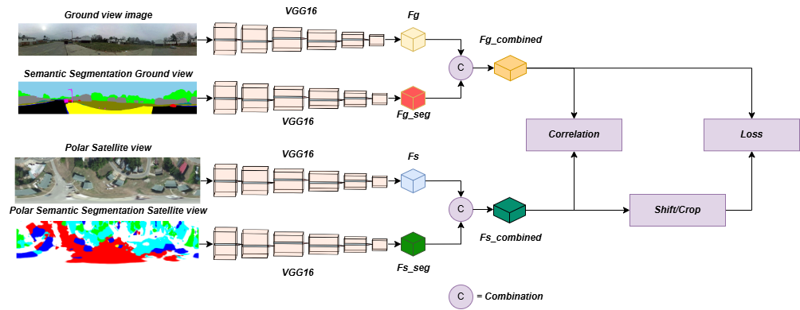

# Enhancing Ground-to-Aerial Image Matching for Visual Misinformation Detection Using Semantic Segmentation

<p align="justify">This refers to "Enhancing Ground-to-Aerial Image Matching for Visual Misinformation Detection Using Semantic Segmentation". It produces our results on an enriched subset of the CVUSA dataset.</p>

## Abstract
<p align="justify">The recent development of generative AI techniques, which has increased the online diffusion of altered images and videos, raises concerns about the credibility of digital media accessible on the Internet and shared by information channels and social networks. Domains that rely on this data, such as journalism, forensic analysis, and earth observation, are suffering because of this problem. At this aim, being capable of geolocating a non-geo-tagged ground-view image without external information, like GPS coordinates, is becoming crucial. 
This study addresses the challenge of linking a ground-view image to its corresponding satellite image without relying on GPS data. To achieve this, a novel four-stream Siamese-like architecture, Quadruple Semantic Align Net (SAN-QUAD), was introduced. SAN-QUAD expands previous SOTA methods with the use of new features, such as semantic segmentation, for both ground and satellite images. The results show notable improvements over previous methods across all tested fields of view (FoV) on the CVUSA dataset.</p>

## Model 


## Requirements
1. This code uses a ```tensorflow``` docker with libraries ```opencv-python 4.8.0.74``` ```pillow 10.0.0``` ```transformers```, ```torch```, ```gradio_imageslider```, ```gradio 4.14.0```, ```torchvision```, ```huggingface_hub``` and runs on modern GPU of at least 6GB of memory
2. We run the code with ```Python 3.9.2```
3. Download the used CVUSA subset at the following link: 
    - https://drive.google.com/file/d/11DR7zhd6wchdyt8DSkTY2JGgf_jrtf1D

## Steps
- Clone this repository 
    - ```git clone https://github.com/MatteoPannacci/SemanticAlignNet.git```
- For training run the following command from the shell:
    - ```python train_no_session.py --train_grd_noise 360 --train_grd_FOV $YOUR_FOV --test_grd_FOV $YOUR_FOV```
    - This command will run the python file ```train_no_session.py```, inside it there are other possible parameters to pass as input or to leave as default value
    - ```$YOUR_FOV``` choose a value bewteen 0° and 360°, that is the FoV value used for the ground view images
    - The trained model will be saved in the path ```./saved_models/model_name/```, will be created a folder for each trained epoch and a ```.txt``` file with a recap of the training
- For testing run the following command from the shell:
    - ```python test_no_session.py --train_grd_noise 360 --train_grd_FOV $YOUR_FOV --test_grd_FOV $YOUR_FOV```
    - This command will run the python file ```test_no_session.py```, inside it there are other possible parameters to pass as input or to leave as default value
    - ```$YOUR_FOV``` choose a value bewteen 0° and 360°, that is the FoV value used for the ground view images
    - The results of the testing phase will be saved in a ```.mat``` file
- Dataset
    - Once you downloaded the dataset you will have the following folders:
	    - ```bingmap``` this folder contains the original satellite view images
	    - ```polarmap``` 
            - ```normal``` this subfolder contains the polar transformed satellite images
            - ```segmap``` this subfolder contains the polar transformed segmetation mask images
		- ```segmap``` here are contained the original segmented mask images
        - ```streetview``` this folder contains the ground view images (streetview)
        - ```streetview_depth``` this folder contains the depth estimation masks of the ground view images
        - ```streetview_segmentation``` this folder contains the semantic segmentation masks of the ground view images
